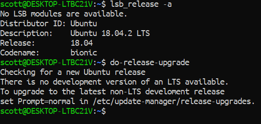
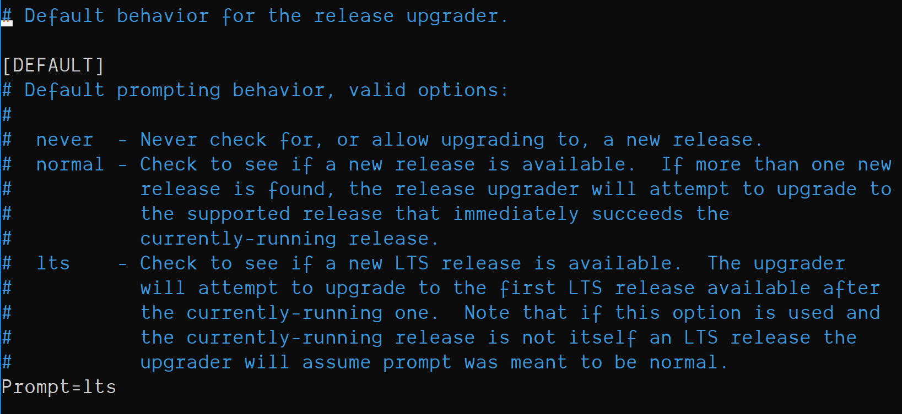
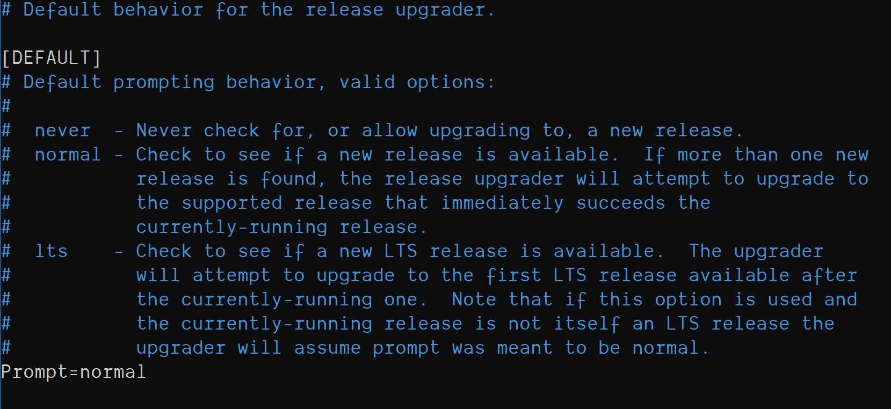
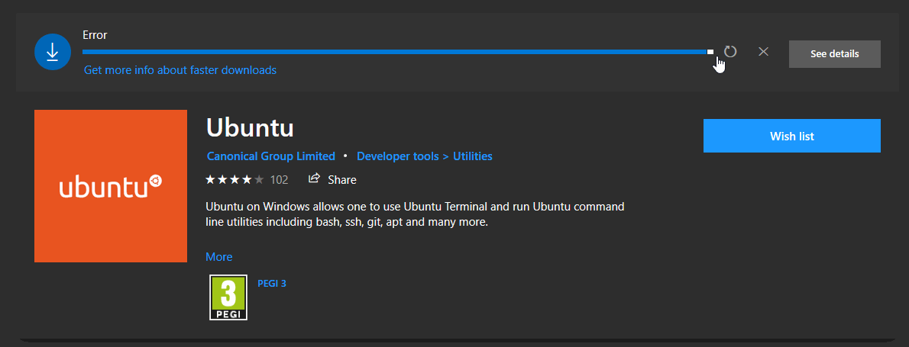

## Already use WSL with Ubuntu? Want an Upgrade??

This is a guide that will cover upgrading Windows Subsystem Linux
(WSL) from the current LTS version to the latest 'normal' version
18.10.

I found this post on [dev.to] this weekend detailing going from
version 18.04 to 18.10 on Ubuntu for Windows Subsystem Linux. You will
know form [earlier posts from me] that trying to go the update route
on WSL is time consuming and you're basically better off starting
again.

I tried it myself and got in a bit of trouble, you can see by checking
out the comments on [David's post]

So from uninstalling my version of Ubuntu I went ahead and tried
again, if you have read the comment's on [David's post] you'll see
that I came up against an issue with being unable to reach the 'snap
store'. I don't know what that is or means but basically it stopped my
upgrade and I was left not knowing if I was fully upgraded or not.

Thankfully someone else had come across the same problem and asked on
[Stack Overflow], basically you need to uninstall Lxd with:

```bash
sudo dpkg --force depends -P lxd; sudo dpkg --force depends -P lxd-client
```

Now we can go about updating Ubuntu with the `do-release-upgrade`
command, if you do that right away you may see something along the
lines of:



This is setting the updater to to only check for Long Term Support
versions, we're going to change that now by changing the prompt from
`lts` to `normal`, in bash use:

```bash
sudo nano /etc/update-manager/release-upgrades
```

You should see the default release upgrader settings:



You'll need to set it to normal:



Now we can go and do the release upgrade command:

```bash
sudo do-release-upgrade
```

## Upgrade time!

Now I was quite surprised that it didn't _really_ take that long at
all for the upgrade to complete, you may get asked questions about
modified packages and weather you want to accept the maintainers or
keep your version, I will always go with the maintainers version of
any packages. You can do what you like with yours, I'm not your mum 😜

## That's it

You should now have your Ubuntu WSL version at 18.10 👏


If, like me, you uninstalled Ubuntu and tried to reinstall it and are
getting errors like this:



Then what worked for me was to restart the `LxssManager` via a
PowerShell console with admin rights.

```powershell
Get-Service LxssManager | Restart-Service
```

## Wrap up!

We went ahead an upgraded our WSL Ubuntu version from 18.04 to 18.10,
we removed Lxd which isn't needed on WSL but is part of the Microsoft
Store version 🤷‍♂️

Then we changed the default behaviour of the release upgrader from
`lts` to `normal`.

Once we have done those two parts we can then go ahead and upgrade
Ubuntu with `do-release-upgrade.

**Thanks for reading** 🙏

Please take a look at my other content if you enjoyed this.

Follow me on [Twitter] or [Ask Me Anything] on GitHub.

<!-- Links -->

[twitter]: https://twitter.com/spences10
[ask me anything]: https://github.com/spences10/ama
[dev.to]: https://dev.to
[earlier posts from me]:
  https://scottspence.com/2018/12/24/wsl-bootstrap-2019/#update-upgrade-and-autoremove
[david's post]:
  https://dev.to/david_j_eddy/how-to-upgrade-wsl-ubuntu-18-04-to-18-10-203
[stack overflow]:
  https://askubuntu.com/questions/1119301/your-system-is-unable-to-reach-the-snap-store
[codesandbox.io]: https://codesandbox.io
[render props]: https://reactjs.org/docs/render-props.html
[using the react context api]:
  http://localhost:8899/react-context-api-getting-started
[example code]: https://codesandbox.io/s/1vnvko0zqj
[even]: https://youtu.be/8ruJBKFrRCk?t=93
[gatsby documentation]:
  https://www.gatsbyjs.org/docs/use-static-query/
