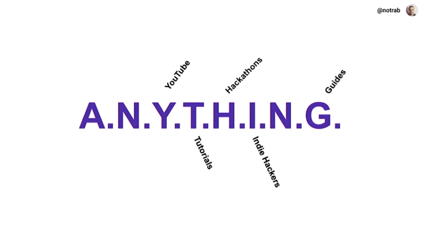

<script>
  import YouTube from '$lib/components/youtube.svelte'
</script>

React Advanced London going deep!

Here's my recollection of my attendance at React Advanced London 2019
supported with videos from the event.

## Ken Wheeler - React Performance

Ken's keynote didn't disappoint! Ken talks about how performance fixes
aren't prescriptive and it's more like a puzzle to figure out.

To help with this he prescribed the IMDOPE system!

### IMDOPE System

- **I**dentify that a problem exists
- **M**easure your timings
- **D**evelop a plan
- **O**pen dev tools
- **P**lay around until its better
- **E**njoy newly performant app

Ken detailed an animation running at 60 frames per second and how that
appears on the performance tab.

The user Timings API (which I've never heard of) lets you define
precise performance marking that you can name and display in dev
tools.

**Example:**

```bash
performance.mark('mainthread-start')
# do expensive things for performance
performance.mark('mainthread-stop')
performance.measure('mainthread', 'mainthread-start', 'mainthread-stop')
```

React does not control renders by default, very often problems
relating to performance are related to unnecessary renders.

React is _generally_ not great when you have a lot of components
rendering and re-rendering at the same time (cough React Memo!)

The React dev tools profiler got a mention and there was a demo of how
react will re-render all the things if you have many components in a
view using the React dev tools profiler.

There was an amusing part where when trying to demo the `useCallback`
React API where Ken missed out the second argument and had to consult
the React docs to clarify.

> "as developers almost everything we do is building elaborate lists
> of shit"
>
> -- Ken Wheeler

List should be virtualized, check out Brian Vaughn's [React Window] or
[React Virtualized] he went on to render lists with 10k plus items in
there and demoed the shoddy performance on a rendered list then with
react window.

**Web Workers**

A particularly interesting section for me (because I didn't know it
was a thing), with web workers you can take expensive tasks off of the
main thread.

There are some downsides to this relating to serialization though.

**WASM**

He finished up with an auto tune example made with Rust and a Google
audio worklet to process a stream of audio to do the Daft Punk "one
more time" vocoder example! Dope!

<YouTube youTubeId="t8svxxtUTl8" />

## Sean Wang - React (with hooks) from scratch

Bonkers talk from Sean where he recreated React with Hooks and React
Concurrency (Fibre) in a [CodeSandbox.io] session.

The talk was a sequel to a previous talk on [React hooks from scratch]
in 29 lines. He started with "we're going to re-create concurrent
React in 130 lines of code!".

At blazing fast speed he covered many concepts, a lot I was unfamiliar
with relating to React, topics covered:

- React Fiber
- "Rendering"
- Linked List Traversal
- Reconciliation vs Commit
- `useState` hook
- Work loop
- Suspense

First, the POJO! (Plain Old JavaScript Object):

```js
const element = {
  type: 'h1',
  props: {
    children: 'Hello world',
  },
}
```

Then went on to define what a fiber was, which is an extension on the
POJO:

```js
const element = {
  type: 'h1',
  props: {
    children: 'Hello world',
  },
  dom: domNode,
  parent: parentFiber,
  child: childFiber,
  sibling: null,
  alternate: currentFiber,
  effectTag: PLACEMENT,
  hooks: [],
}
```

I'll be honest, the speed at which Sean went, although very concise
was quite though to follow at times.

He covered all the main sections along with code examples. TL;DR
suspense with time slicing is here.

The only dependency used in the code was Babel with this [fetch
example] where the we're using state and reading from a resource which
suspends (or caches) as needed.

<YouTube youTubeId="dFO4m7Y-yhs" />

## Vojtech Miksu - What a Drag

Vojtech (Uber) goes through the history lesson about drag and drop and
the complexities that come with it.

He details the options available and why they implemented their own
[React Movable] Accessible drag and drop project.

<YouTube youTubeId="y_XkQ2qMTSA" />

Here's the same talk from RSCONF 2019:

<YouTube youTubeId="373pc0AbR9M" />

## Daniel Irvine - Don’t Let Your Unit Tests Slow You Down

Six ideas that can help improve your testing.

<!-- | Developer Tests             | QA tests                      |
| --------------------------- | ----------------------------- |
| Encode requirements         | Encode requirements           |
| Catch regression            | Catch regression              |
| Assist with design          | Catch performance degradation |
| Guide refactoring           | Check usability               |
| Explain your code to others |                               |
| Pinpoint errors             |                               |
| Minimise debugging          |                               |
| Minimise manual testing     |                               | -->

**Idea 1:**

Always follow _Arrange Act Assert_, get the variables in place,
render, expected result.

Keep tests simple

**Idea 2:**

Test the _lifecycle_ of your components.

**Idea 3:**

Be aware of tests surface areas, good test pinpoint errors.

**Idea 4:**

Make a mess, then refactor.

**Idea 5:**

Get out of React components at every opportunity. Testing simple
functions, simple, React component, not so simple to test.

**Idea 6:**

Write your own test library! 😱

It will help you understand the DOM better and further your
learning!!!

Library's lock you into _their_ way of testing things.

**Main takeaway for me from this is:**

> No tests are better than bad tests!

<YouTube youTubeId="1vDXRDQ9aJE" />

After this talk I was off to the React native hall to go see some of
the lightening talks as I knew one of the speakers.

## Dave Nicholas - Functions vs Classes

He discussed the migration from classes over to functional components
at Tesco.

## Jamie Barton - Teaching and Sharing Awesome Content 101

A non technical talk about teaching what you have learned as someone
will benefit from it.

That can be in the form of ANYTHING. It wasn't quite as memorable as
Ken's IMDOPE system but it was the message was what was important.

Jamie went on to talk about how the community can benefit from any
kind of sharing.



- YouTube video or video series

- Tutorials

- Hackathons, hosting or organising

- Indie Hackers, posting milestones

- Guides

Something that resonated with me was the quite:

> "Write the guide you needed as a developer when trying to do this."

I have been doing this for a long time myself now and it's something I
believe in a lot.

## Lunch

## Siddharth Kshetrapal - Design Systems Design System

Sid gave a good overview of making design systems. Or designing design
systems.

> "When I started laying out a system last year I would just call them
> gray, gray darker and gray darkest."

Basically there always a colour that's not on there.

Then he came out with this gem!

```js
const theme = {
  colours: {
    grays: {
      100: '#fff9f9'
      200: '#e6e6e6'
      300: '#999999'
      400: '#757575'
      500: '#242424'
      700: '#151515'
      900: '#111111'
    }
  }
}
```

So you can add in more colours if you need them, add a 150, or add a
600 here.

Sid then went on to talks about how awesome styled-components was and
some nice touches for that:

```js
import styled from 'styled-components'

const FormLabel = styled.label(
  props => `
  color: ${props.theme.colors.text.subtle}
  font-size: ${props.theme.fontSizes[2]}
`
)
```

Looks pretty verbose so you could use `@styled-system/css` to reduce
that:

```js
import styled from 'styled-components'
import css from '@styled-system/css'

const FormLabel = styled.label(
  css({
    color: 'text.subtle',
    fontSize: 2,
  })
)
```

Pretty neat stuff!

<YouTube youTubeId="Dd-Y9K7IKmk" />

## Emma Brillhart - A More Readable React Codebase Using TypeScript, GraphQL, and Hooks

Emma's talk centered around why TypeScript is awesome and how
readability enables faster onboarding for developers.

Using TypeScript on the client side give built in documentation,
better navigation, less technical debt.

<YouTube youTubeId="nkJbGgieALI" />

<!-- Links -->

Complete playlist of all the talks on YouTube [here].

Check the [hashtag] on Twitter and also [my coverage] on Twitter.

https://twitter.com/search?q=spences10%20reactadvanced&f=live

[codesandbox.io]: https://codesandbox.io
[fetch example]: https://codesandbox.io/s/reactadvanced-final-uwrx0
[react virtualized]: https://github.com/bvaughn/react-virtualized
[react window]: https://github.com/bvaughn/react-window
[react hooks from scratch]: https://www.swyx.io/speaking/react-hooks/
[react movable]: https://github.com/tajo/react-movable
[here]:
  https://www.youtube.com/playlist?list=PLNBNS7NRGKMH7yfpYQD4TrFV25SMOCIPM
[hashtag]: https://twitter.com/hashtag/ReactAdvanced
[my coverage]:
  https://twitter.com/search?q=reactadvanced%20spences10&f=live
